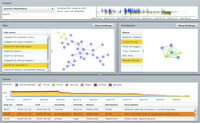
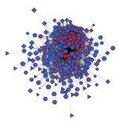

Patrick Wagstrom's Research Projects
====================================

My current research interests address the ways that individuals
collaborate, communicate, and learn while building complex software
projects. This takes me to the intersection of software engineering,
organizational behavior, and social psychology. These topics are a
snapshot of my current research interests. For a more complete list of
my past research output please see either
[my publications page][publications] or the
[publications section of my cv][cv-publications].

The following entries appear in no particular order. For example,
although Technical Debt is at the top, it is not my primary area of
research.

[Technical Debt][technical-debt]
--------------------------------

At some point in time every developer has written a piece of code that
they know will have to be replaced in the future. By knowingly writing
code that will have to be replaced the developer causes a project to
take on technical debt. Our research examines the
[different ways that projects incur technical debt and how it might be used as a positive tool rather than strictly a potential cost][technical-debt].

[Software Ecosystems][gnome]
---------------------------

Software projects are rarely developed in isolation. In most cases
they interface with a number of other projects both through technical
interfaces and also through the social interfaces provided by their
hosting platform (e.g. GitHub, Google Code, SourceForge) or through
their management framework (e.g. Apache Projects). I've conducted a
lot of research that examines how both of these construct affect the
development of a project. During my Ph.D. thesis work I crafted a
[large dataset from the GNOME project, which I've since made publicly available][gnome]. More
recently I've started to use graph and network analysis to collect a
[large dataset from GitHub that is focused on the Ruby on Rails project][rails].
 
[Software Organizations][software-organizations]
---------------------------------------

On occassion I've created papers that study software engineering teams
that are almost management style papers. In particular, I did a survey
based work with Jonathan Krein, Chuck Knutson, Stan Sutton, and Clay
Williams that examined how orgnaizations share information (or fail
to) and attempted to understand the impacts of these issues. Later I
did a single paper for the Workshop on Social Software Engineering at
FSE 2011 that examined how information needs and brokerage affects the
collaboration needs of an organization.

[Collaborative Development][collaborative-development]
-------------------------

On occassion I'm involved with a project that involved direct study or
implementation of a specific software development tool - most often
these are somehow related to
[collaborative development][collaborative-development]. In particular,
I created a tool with Anita Sarma and Larry Maccherone called
Tesseract that visualizes communication requirements as defined by the
Socio-Technical Congruence metric that Marcelo Cataldo, Jim Hebrlseb,
Kathleen Carley, and I developed.

[][collaborative-development]

Within IBM I led a team that studied how all classes of users,
including software engineers, designers, product managers, testers,
and more use [Rational Team Concert][rational-team-concert] to create
high quality software. This study examined the affordances of the
tooling and included a study that evaluated the efficiency of
interacting with the various components of Rational Team
Concert. Subsequently this led to work with [JazzHub][jazzhub] team on
instrumented and their tools to provide responsive analytics. As this
work was internal IBM research, sadly there are no publications on
these projects.

More recently I've become interested in the emerging possibilities
unlocked through the use of cloud development environments. This was,
which is ongoing with Yi Wang and Evelyn Duesterwald uses a novel
method of recording user behavior that is possible in cloud based
environments to better understand and predict the transitions in
behavioral state as users develop software.

[Personal Branding][personal-branding]
--------------------------------------

[][personal-branding]

Building a strong online brand requires more than just getting as many
followers as possible. We argue that it is more important to
understand the overlap between your interests, the interests of those
you follow, and the interests of those that follow you. This research
utilized Twitter data and publicly available APIs from organizations
such as Klout and PeerIndex to calculate the overlap in interests and
passions between you, your followers, and those that follow you. On a
personal level, this proved to be insightful to me as it showed that I
had a split personality on Twitter that wasn't effective in creating a
personal brand. Half of my personality was focused around running and
the other half was focused on software engineering. This created a
profile that was confusing at best and led to my forking of profiles
into my software engineering profile ([@pridkett][twitter-pridkett])
and my running profile ([@RunPatrick][twitter-runpatrick]).

[publications]: ../publications/
[cv-publications]: ../cv/#publications
[gnome]: gnome/
[technical-debt]: technical-debt/
[personal-branding]: personal-branding/
[collaborative-development]: collaborative-development/
[software-organizations]: software-organizations/
[twitter-pridkett]: https://twitter.com/pridkett/
[twitter-runpatrick]: https://twitter.com/RunPatrick/
[jazzhub]: https://hub.jazz.net/
