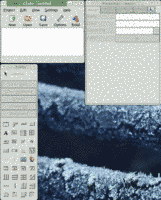
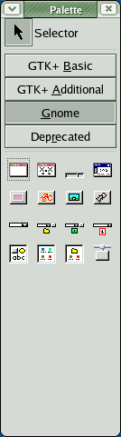
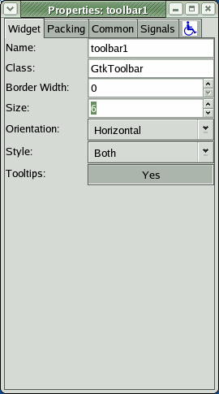
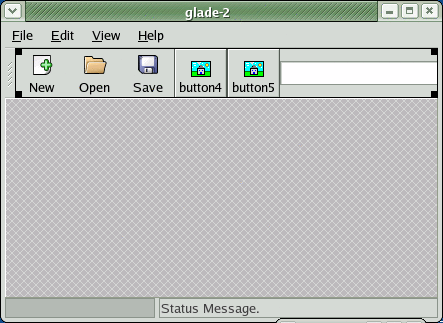
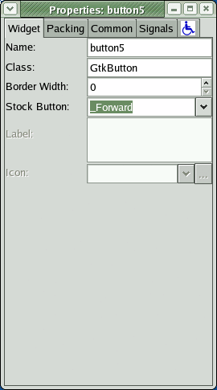
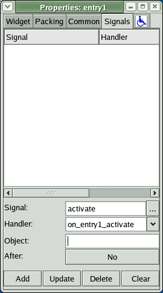
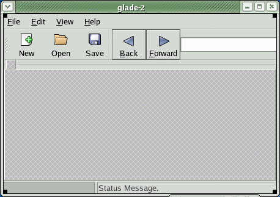
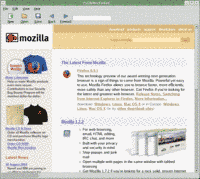
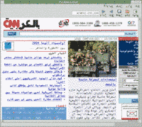

<h2>Overview</h2>1. <a href="#section1">Introduction</a> 2. <a href="#section2">Starting with Glade</a> 3. <a href="#section3">Python Code</a> <h2 class="sectionTitle">1.  Introduction</h2>
      
This tutorial will show you how to build a simple web browser for the GNOME
desktop using the <a href="http://www.python.org/">Python</a> programming
language.  It is based off the tutorial that Erik Dasque has written for
<a href="http://primates.ximian.com/~edasque/projects/Tutorial/glade2.html">Mono
and C#</a>.
      
For this tutorial you're going to need the following tools.

* <a href="http://www.python.org/">Python</a> version 2.2 or above</li>
* <a href="http://www.pygtk.org/">PyGTK</a>- GTK+ bindings for Python</li>
* <a href="http://www.mozilla.org/">Mozilla</a> - you'll need to make sure the development libraries are also installed on your system.</li>
* <a href="http://sourceforge.net/projects/pygtkmoz">PyGtkMoz</a> - Python bindings for the GTK+ Mozilla Widget</li>
* <a href="http://glade.gnome.org/">Glade</a> - GTK+ user interface builder</li>
      
Unfortunately, installation of these tools is beyond the scope of this tutorial.  For most versions of Linux you can install them using apt-get, yum, or urpmi.
  
<h2 class="sectionTitle">2.  Starting with Glade</h2>
      
The first task that we'll need to do is to start with Glade.  Glade is a user
interface builder for GTK+.  The version that we'll be using is Glade-2.  You
can start it from the command line using the command glade-2.  When you start it up you'll see a set of
windows like the ones below in figure <a href="#figure-fig1">1</a>.

 

      Figure 1: Glade startup window

Click on the new and tell it that you want to
start a new GNOME project.  This will make the tool palette go undimmed and
you'll now be able to create your user interface.  On the palette click on
Gnome button and select the Gnome Application
Window, as shown in figure <a href="#figure-fig2">2</a>

 

      Figure 2: Select Gnome application window

This will bring up a simple window that says glade-2 for the title.  Click on the toolbar in an area
where there are no buttons currently.  This will select the toolbar and its
properties will come up in the property window.  Change the size of the toolbar
from 3 to 6.  We'll be adding three more widgets to the toolbar.
    

 

      Figure 3: Change toolbar size from 3 to 6

The next step is to populate the toolbar with new buttons.  To do this we'll go
back to the palette and select GTK+ Basic.  We
want to add two buttons in the first two spots and a text entry in the third
spot.  When you've done this, your window should look like the one in figure <a
href="#figure-fig4">4</a>
    

 

      Figure 4: Add two buttons and a text entry widget

The next step is to convert the buttons we've just created to stock buttons.
In this case we'll want to use the forward and back stock buttons.  Click on
the buttons, this will bring up their properties in the property window.  Click
on the Stock Button pull down and select Forward
and Back for the respective buttons.
    

 

      Figure 5: Change the buttons to the stock buttons

As right now we're focusing on keeping the browser simple, most of the widgets
aren't going to be hooked up to anything.  But we do want to hook up the
location bar so we can type URLs and look at different web pages.  To do this,
click on the text entry we added to make it active in the properties window.
The select the signals tab.  Click on the ellipsis
by the signal field and select activate.  A text entry emits the activate signal when
the enter key is pressed in it.  This will make a default handler of on_entry1_activate, which is fine.  Click on the Add button to add it.  If you don't click the Add button it won't be added and you're work will be for
naught.
    

 

      Figure 6: Adding the signal handler for the entry

The final step we'll want to do in glade is to add a holder for our Mozilla
widget.  Unfortunately, Glade doesn't have the ability to add the widget
natively, but that's not a big deal.  We do this by adding a frame to the
application window.  Select the frame widget from the bottom of the GTK+ Basic
widgets, then click to add it into the open spot in the application.  The click
on the label and hit the delete key to remove the label from the widget.  When
you're done, you should have a window that looks like the one shown below in
figure <a href="#figure-fig6">7</a>.
    

 

      Figure 7: Our final window in Glade

Click on the save button in Glade window that has app1 listed.  Save the program as pygtkmozembed.  The rest of the options don't really
matter because we're not actually generating the code for C or C++.  Just hit
OK. 

  <h2 class="sectionTitle">3.  Python Code</h2>
      
Now on to the meat of the program, the Python.  Although, you'll soon see that
there isn't much to this, Glade has taken care of a lot of the work we thought
we'd have to do.  To start off we need some initial code that will be helpful.
The code shown in snippet <a href="#snippet-snip1">1</a> make it so the program
can run by itself, imports all the libraries we need and also sets some
constants for our program that will be useful.
    


#!/usr/bin/env python

import gtk
import gnome.ui
import gtk.glade
import gtkmoz

APPNAME=“PyGtkMozEmbed”
APPVERSION=“0.1”


Snippet 1: Importing code

The next thing we'll want to do is to create a simple wrapper that will
initialize GNOME application and load all of the widgets.  We'll call this
class WidgetsWrapper as it wraps around all of our widgets.  The code for this
appears in snippet <a href="#snippet-snip2">2</a>.
    


class WidgetsWrapper:
    def init(self):
        gnome.init(APPNAME, APPVERSION)
        self.widgets = gtk.glade.XML(“pygtkmozembed.glade”)
        self.mozillaWidget = gtkmoz.MozEmbed()
        self.widgets.get_widget(“frame1”).add(self.mozillaWidget)
        self.mozillaWidget.set_size_request(800,600)
        self.mozillaWidget.show()
        self.mozillaWidget.load_url(“http://www.mozilla.org/")

        signalDic = { “on_entry1_activate” : self.on_entry1_activate,
                      “on_quit1_activate” : self.on_quit1_activate}
        self.widgets.signal_autoconnect(signalDic)


Snippet 2: Widgets wrapper

Briefly this what the program does up to this point.  First is registers itself
as a Gnome application.  Then it loads up all of the widgets from our glade
file we just created.  This is what will allow us to handle signals that are
sent by widgets.  Then it creates a widget called mozillaWidget which will hold our instance of a Mozilla
web browser.  Before we can use the widget, we need to add it to our program,
which is what the line after that does.  Finally, the widget is told to make
itself visible and then load the mozilla home page as a start page.

We're to the point where we should have something that is usable.  Add the
following little bit of glue code at the end of your program and we'll have a
runnable program.  If you want to test it at this point, you'll be able to run
it and browse the Mozilla.org webpage and any pages that link to it, but you
can't use the address bar yet.
    


if name == “main“:
    widgets = WidgetsWrapper()
    gtk.mainloop()


Snippet 3: Glue code

But we're not happy with that.  There are a couple of issues.  First the
program doesn't exit nicely.  You can kill the window, but you still need to
use Ctrl-C to kill the program.  Secondly, the address bar doesn't work.  This
is where our signals take hold.  To do that, we first add the code in snippet
<a href="#snippet-snip4">4</a> to our WidgetsWrapper.__init__ and then we add the methods in
snippet <a href="#snippet-snip5">5</a> to our WidgetsWrapper class.
    


        signalDic = { “on_entry1_activate” : self.on_entry1_activate,
                      “on_quit1_activate” : self.on_quit1_activate}
        self.widgets.signal_autoconnect(signalDic)


Snippet 4: Attaching signal handler


    def on_entry1_activate(self, widget):
        self.mozillaWidget.load_url(widget.get_text())
    def on_quit1_activate(self, widget):
        gtk.main_quit()


Snippet 5: Signal handlers

signal_autoconnect takes a dict and connects the signals to the appropriate
functions.  In a future tutorial I'll show a niftier way to do this, but this
will work fine for now.
      
Then we simply create the methods.  Both of the methods just take one argument,
the widget that emitted the signal.  For our text entry, we just want to load
the new URL that has been entered.  The other method allows you to use the
file-&gt;quit menu option to exit the program.
    


#!/usr/bin/env python

import gtk
import gnome.ui
import gtk.glade
import gtkmoz

APPNAME=“PyGtkMozEmbed”
APPVERSION=“0.1”

class WidgetsWrapper:
    def init(self):
        gnome.init(APPNAME, APPVERSION)
        self.widgets = gtk.glade.XML(“pygtkmozembed.glade”)
        self.mozillaWidget = gtkmoz.MozEmbed()
        self.widgets.get_widget(“frame1”).add(self.mozillaWidget)
        self.mozillaWidget.set_size_request(800,600)
        self.mozillaWidget.show()
        self.mozillaWidget.load_url(“http://www.mozilla.org/")
        signalDic = { “on_entry1_activate” : self.on_entry1_activate,
                      “on_quit1_activate” : self.on_quit1_activate}
        self.widgets.signal_autoconnect(signalDic)

class WidgetsWrapper:
    def on_entry1_activate(self, widget):
        self.mozillaWidget.load_url(widget.get_text())

    def on_quit1_activate(self, widget):
        gtk.main_quit()

if name == “main“:
    widgets = WidgetsWrapper()
    gtk.mainloop()



Snippet 6: Full program code

Now you'll want to try and run the program.  The simplest way is just to type
python pygtkmozembed.py.  However, there is a
chance you'll get an error about not being able to find libraries.  This is
because either you haven't added the Mozilla library to your /etc/ld.so.conf or it's not in your LD_LIBRARY_PATH environment variable.  In that case you
might want to try running the program by typing LD_LIBRARY_PATH=$LD_LIBRARY_PATH:/usr/lib/mozilla-1.6 python
pygtkmozembed.py.  With the program running you should see something
like the picture in figure <a href="#figure-fig8">8</a>.
    

 

      Figure 8: Final program running

      
Of course, I'd be remiss if I didn't show that I can do all sorts of other
langauges too.  This is all due to the fact that we used stock widgets in our
program.  If you run the program using the command line LANG=ar_SA python pygtkmozembed.com the menus will be
Arabic and the text will appear right to left.

 

      Figure 9: Browsing the web in Arabic

At this point, our program works well enough, and this covers everything that
Erik covered in his tutorial.  In the future I'll probably add some updates
that show how to do some more interesting stuff such as activating the forward
and back widgets.  Also, you'll notice that there is no progress given on the
loading of a web page, and no errors are hooked up.  Those will be covered in
the future too.
