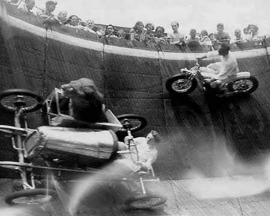

 

<b>A lion in a sidecar on the wall of death?!  AWESOME!</b> 
<b>My thesis defense?  Awesomer!</b> 
(picture of unknown origin) 

Patrick's Awesome Thesis Defense Page
-------------------------------------

Here's where you can find all the information you care to know about my defense.

NOTE: The correct time for the defense is 9:30am.  The rumors of an insanely early morning defense are grossly exaggerated, it's just really early.

**Date:** March 9, 2009

**Location:** Carnegie Mellon University, Wean Hall 4625

**Document:**
a- [ Final Version (double sided)][phd-thesis]
- [ Final Version (single sided)][phd-thesis-single]

**Slides:**
- [ OpenOffice.org Version (Canonical)][defense-slides-odp]
- [ Microsoft PowerPoint][defense-slides-ppt]
- [ Adobe PDF (No Animations)][defense-slides-pdf]

###Abstract

Software engineering is still a relatively young field, struggling to develop consistent standards and methods across the domain.  For a given project, developers can choose from dozens of models, tools, platforms, and languages for specification, design, implementation, and testing. The globalization of software engineering and the rise of Open Source further complicate the issues as firms now must collaborate and coordinate with other firms and individuals possessing a myriad of goals, norms, values, expertise, and preferences. This thesis uses four empirical studies to take a vertical examination of Open Source ecosystems and identify the way that foundations, firms, and individuals come together to create large scale software ecosystems and produce world class software despite their differing goals and values. First, I examine Open Source as a collaborative phenomenon between firms and non-profit foundations that support many communities and identify the ways in which non-profit foundations enable member firms to create value in the ecosystem. Next, an empirical study of direct collaboration between firms within the Eclipse system reveals that most firms operate relatively independently, but there is still heavy reliance on a single dominant player for core portions of the ecosystem. I then evaluate how the presence of commercial firms affects the attraction and retention of volunteer developers in an Open Source community. The final study examines how individual developers manage their dependencies in Open Source and extends the Socio-Technical congruence metric to address changing requirements and facilitate the metric as a tool for continual use. Finally, based on the findings of these studies, I close with a set of recommendations for stakeholders investing in Open Source.

###Changes in Drafts

**4/22/2009** - Added in discussion about the possible difficulties in adopting recommendations presented in chapter 6.

**4/18/2009** - Integrated changes requested at thesis defense.  Changed model in chapter 4 from multi-level model to a linear regression and added work to show how the data had time lagged dependencies.  Broke out the recommendations in chapter 6 into nine distinct and explicit recommendations.  Fixed wording requests from Granger.  Added standardized betas to relevant regression in chapter 5 and more explicitly explained matched communication vs extra communication.

**3/1/2009** - Proofed all chapters.  Noticed I was missing the table showing the original regression on network congruence in Open Source, this was added in section 5.3.4 and resulted in renumbering of the tables in chapter 5.

**2/28/2009** - Proofed through chapter 4.  Still have chapter 5 and 6 to go.

**2/27/2009** - Cleaned up introduction.  Cleared up questions in chapter 2 as per Jim's request.  Spell check on whole document.  Fixed all references.

**2/25/2009** - Reworked introduction for Chapter 5 on individual communication and Socio-Technical congruence.

[phd-thesis]: ../thesis/wagstrom-phd-thesis.pdf
[phd-thesis-single]: ../thesis/wagstrom-phd-thesis-single.pdf
[defense-slides-odp]: ../thesis/wagstrom-defense-slides.odp
[defense-slides-ppt]: ../thesis/wagstrom-defense-slides.ppt
[defense-slides-pdf]: ../thesis/wagstrom-defense-slides.pdf
