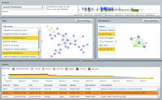
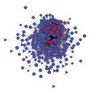

Patrick Wagstrom's Research Projects
====================================

My current research interests address the ways that individuals collaborate, communicate, and learn while building complex software projects. This takes me to the intersection of software engineering, organizational behavior, and social psychology. These topics are a snapshot of my current research interests. For a more complete list of my past research output please see either [my publications page][publications] or the [publications section of my cv][cv-publications].

[Technical Debt][technical-debt]
--------------------------------

At some point in time every developer has written a piece of code that they know will have to be replaced in the future. By knowingly writing code that will have to be replaced the developer causes a project to take on technical debt. Our research examines the [different ways that projects incur technical debt and how it might be used as a positive tool rather than strictly a potential cost][technical-debt].

[Software Ecosystems][gnome]
---------------------------

See my page on [GNOME research][gnome].
 
[Software Organizations][software-organizations]
---------------------------------------

Paper on private information at ICSSP 2011
Paper on information management at SSE 2011

[Collaborative Development][collaborative-development]
-------------------------
[][collaborative-development]

[Personal Branding][personal-branding]
--------------------------------------

Building a strong online brand requires more than just getting as many followers as possible. We argue that it is more important to understand the overlap between your interests, the interests of those you follow, and the interests of those that follow you.

[publications]: ../publications/
[cv-publications]: ../cv/#publications
[gnome]: gnome/
[technical-debt]: technical-debt/
[personal-branding]: personal-branding/
[collaborative-development]: collaborative-development/
[software-organizations]: software-organizations/
